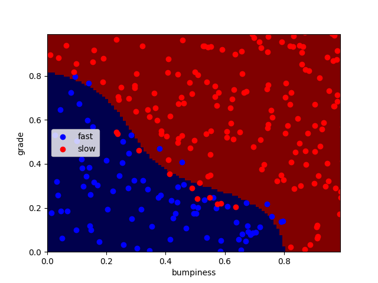

# SVM Terrain Classification

This project implements an SVM (Support Vector Machine) classifier to distinguish between two types of terrain points based on given features. The dataset is generated using the `makeTerrainData()` function, and the classifier's decision boundary is visualized using the `prettyPicture()` function.

## Project Structure
```
|-- svm_terrain_classifier.py  # Main script for training and testing the SVM model
|-- class_vis.py               # Contains the prettyPicture() function for visualization
|-- prep_terrain_data.py       # Generates the training and testing datasets
|-- README.md                  # Project documentation
```

## Requirements
Make sure you have the following Python libraries installed before running the script:

```bash
pip install numpy matplotlib scikit-learn
```

## Usage
Run the `svm_terrain_classifier.py` script to train the model, evaluate accuracy, and visualize the decision boundary.

```bash
python svm_terrain_classifier.py
```

## Output

- The script prints dataset shapes and model accuracy in the console.
- The decision boundary of the SVM classifier is displayed as a matplotlib plot.

### Console Output
```
Training features shape: (750, 2)
Training labels shape: (750,)
Test features shape: (250, 2)
Test labels shape: (250,)
Model Accuracy: 0.92
```

## Troubleshooting
- If `prettyPicture()` is not found, ensure `class_vis.py` is in the same directory.
- If `makeTerrainData()` does not work, verify that `prep_terrain_data.py` is correctly implemented.

